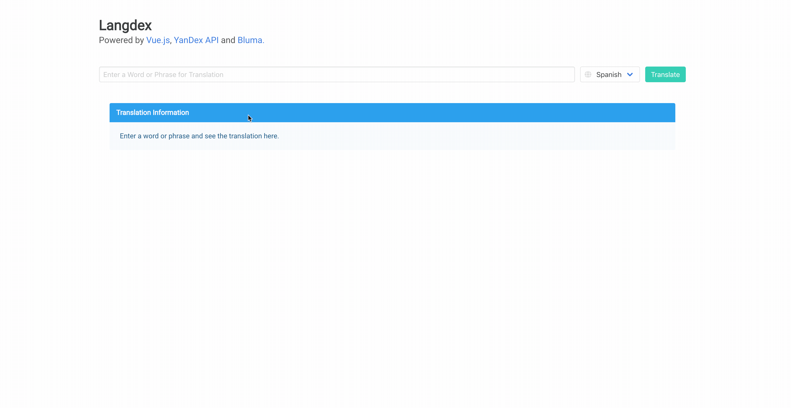

## Langdex [](https://travis-ci.org/nicholasadamou/Langdex)



A simple UI used for translating words and phrases into other languages.


[](https://saythanks.io/to/NicholasAdamou)

## What is "Langdex"?

A web application used for translating words and phrases to other languages.

## Features

This project uses:

* [yandex-api](https://www.omdbapi.com/)
* [vue-js](https://vuejs.org/)
* [Bluma](https://bulma.io/)

## Install Dependencies

The following snippet only needs to be ran once if dependencies are not installed:

```bash
yarn install # Installs dependencies
```

## Building & Running the Web App

Simply run, `yarn serve` to compile and hot-reload for development.

## License

Langdex is © Nicholas Adamou

It is free software, and may be redistributed under the terms specified in the [LICENSE] file.

[LICENSE]: LICENSE
